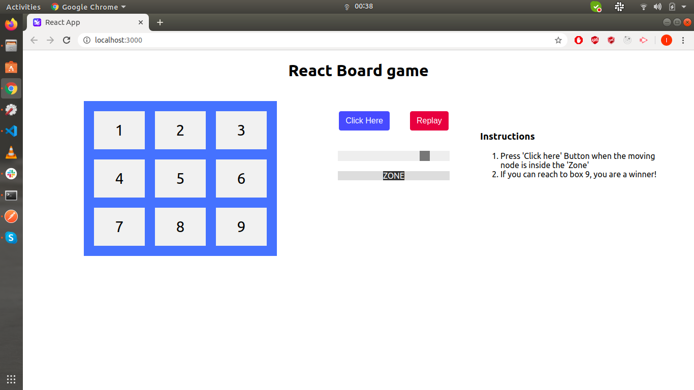

Simple Board Game developed by @MasterIsuru.
Live Example - [https://masterisuru.github.io/react-board-game/](https://masterisuru.github.io/react-board-game/)

## Instructions

In the project directory, you can run:

`npm i`

`npm start`

Then Open [http://localhost:3000](http://localhost:3000) to view it in the browser.
